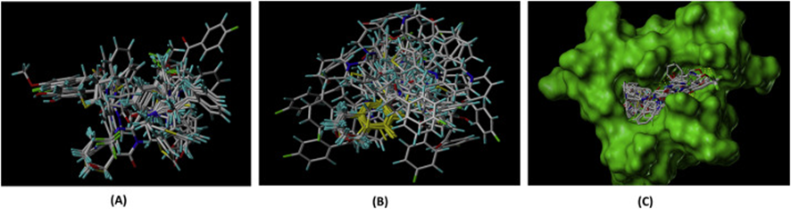

## 背景

記事作成者はデータに基づいて化学を研究するケモインフォマティクスの研究を行っています。反応機構の詳細が分からなかったり分子が巨大な場合などは遷移状態計算が難しいため、分子構造から生物学的特性・化学的特性を直接説明する手法が有効です。分子構造から化学的性質を定量的に説明する手法は定量的物性相関 ( Quantitative Structure-Property Relationships : QSPR ) と呼ばれ、不斉触媒設計等幅広い系で成功を収めています。記事作成者は分子の三次元構造を用いたQSPR法 ( 3D-QSPR ) に着目し、様々な反応の面選択性の予測・可視化モデルを作成しています (図1)。

*CoMFAの概念図*
QSPRと同様に、生物学的性質を定量的に説明する手法は定量的構造活性相関 ( Quantitative Structure-Activity : QSAR ) と呼ばれ、不斉触媒設計等幅広い系で成功を収めています。今回は自分の研究とは少し異なる3D-QSARに関する論文を読み、知識の裾野を広げることにしました。
## 論文情報

https://www.sciencedirect.com/science/article/pii/S002228602031108X

テスト[アンカーテキスト](https://www.sciencedirect.com/science/article/pii/S002228602031108X
)
## 論文概要
本論文のターゲットであるヒトタンキラーゼは人の体内に存在する酵素 (タンパク質) で、axinとTRF-1というタンパク質を修飾し間接的に細胞の増殖と分化に関わっています。ヒトタンキラーゼに阻害剤をドッキングさせると、axinとTRF-1が修飾されず細胞の増殖と分化ができなくなるため細胞が死にます[論文中文献10, 11, 12, 14, 16] (図2)。この方法を用いるとがん細胞を殺すことができるので、抗がん剤としてのヒトタンキラーゼ阻害剤の開発に注目が集まっています [17, 18]。

## 手法

### 実験1 交差検証によるモデルの検証
最初に、ピリミジノン誘導体42種 [文献, 図4] のヒトタンキラーゼに対する50% 阻害濃度 (IC50) についてCoMFA, CoMSIAによる予測性の検証を行いました。

*図4ピリミジノン誘導体42種*
まず、グリッド空間に対してどの向きに分子を配置するか定義します (アライメントといいます)。ドッキングの配向を反映したアライメントを行うことで、その後の解析をよりよいものにできます。本研究では、ピリミジノン誘導体42種について以下の3つの手法 (図5) によるアライメントを検証しています。

(i)	Distill based: 最も強力な活性を有す化合物1[文献]をテンプレートとしたアライメント。構造最適化は分子力場計算で行われた。 (標準 Tripos 力場を使用した Powell 法, NB カットオフ値は 8.00 、反復限界は 10,000 、距離依存誘電率は 1.00 、エネルギー勾配は 0.001 kcal / (mol Å) [22] ) 
(ii)	Pharmacophore based : DISCOTechモジュール [文献] を用いたアライメントを行った。
(iii)	Docking based: TNKS2の結晶構造 ( PDB ID : 3U9Y, Resolution 2.3 Å ) を用いて、SurflexDockモジュール [文献] を用いて結合部位にドッキングさせた。

*図5 (i)~(iii)のアライメントの図*

続いて、各グリッドの特徴量を算出します。グリッド間隔は2.0 Åとしています。CoMFA, CoMSIAでは、各グリッドの特徴量算出の方法が異なります。
CoMFAでは (i)静電場 と (ii)立体場 という概念を以下のように定義します。

(i)	静電場…電荷+1.0の点電荷を各グリッドに配置したときの系のエネルギー変化をクーロンポテンシャルから算出します。分子を構成する各原子の部分電荷はGasteiger Huckel法によって割り当てられたものを用います。
(ii)	立体場…静電場と同様に、sp3炭素を各グリッドに配置したときの系のエネルギー変化をLennard-Jonesポテンシャルから算出します。

このようにして算出された静電場・立体場は、プローブに用いた点電荷やsp3炭素原子と分子を構成する原子が近接した領域で急激に変化します (図6) 。実際にプローブが近接領域に存在すると、分子の構造が最適化され系のエネルギーは緩和されるはずです。CoMFAでは、この問題に対してエネルギーのカットオフを行っています (今回は静電場、立体場ともに30 kcal / mol [23,24] )。

CoMSIAでは近接領域で過大評価になるクーロンポテンシャル、Lennard-Jonesポテンシャルを使わず、ガウス関数を用います (今回はα=0.3 Å-1 [文献] )。同様にして水素結合供与場、水素結合受容場、疎水場を求めています。
CoMFA, CoMSIAいずれも、以上のように算出される静電場、立体場、水素結合供与場…などの特徴量をまとめて分子場と呼びます [25]。

$$
A^q_{F,k}(j)=\Sigma_iw_{probe,k}w_{i,k}e^{-ar_{i,q}}
$$
$$
w_{probe,k}:
w_{i,k}:
a:
r_{i,q}:
$$

*図6 各関数の図[引用*

続いて目的変数を考えます。平衡定数Kと活性化エネルギーΔGは一般に式1で表されるので [教科書]、Kとべき乗の関係であるIC50も対数変換によってΔGと線形関係に帰着することができます。

このようにして算出した分子場と目的変数 pIC50 ( = -ln [IC50] ) の関係を回帰します。分子場は次元数が多く、また共線性の問題もはらんでいるため部分的最小二乗法 ( PLS : partial least squares regression ) が用いられることが多いです。今回も先行例に倣ってPLSが用いられています[補足1]。PLSの主成分数 (ONC) は、leave-one-out (LOO) によって最適化しています[補足2]。予測性の評価に用いるq2は、LOOによって求められた予測値と式2によって算出します[26]。

補足1
PLS回帰は金子先生のスライドが分かりやすいです。

補足2 leave-one-out法
データセットを1つの検証データと残りの訓練データに分割し、訓練データを用いて得られたモデルを使用して検証データを予測する。検証データと訓練データの分割を変えて予測を行い、すべてのデータセットの予測性の検証を行う

結果を表1に示しました。CoMFA, CoMSIAともにq2が0.5以上であり、モデルの堅牢性 [補足3] と予測能力が十分であることを表しています[27]。その中でも、Distill based alignment 1を用いたCoMSIAが最大のq2=0.605を示し、最も良いモデルであったと論文中では結論づけられています。さらに論文著者は計算に用いた各パラメータの寄与率を算出し、水素結合アクセプター領域が活性に最も寄与することを見出しました。ここまでの結論にたどり着くまでに、用いる記述子を色々と検討したようです (表2)。

補足3 堅牢性
多様なデータに対して、特に学習データ内に多く存在しない傾向のデータに対して、適切に予測を行うことができる能力のこと

| Statical Parameters |     Alignment1(Distill based) | Alignment 2(Pharmacophore based) | Alignment 2 (Docking based)
|--| CoMFA|CoMSIA|CoMFA|CoMSIA |CoMFA|CoMSIA |
| q2 | 侍エンジニア1 |      php |
| steric | 侍エンジニア2 |      VBA |
| electric | 侍エンジニア3 |     Java |
| Hydrophobic | 侍エンジニア4 |   python |
| H-bond Donor | 侍エンジニア5 |     ruby |
| H-bond Acceptor | 侍エンジニア5 |     ruby |

### 実験2 外部データに対する検証
LOOによる予測性の検証に加え、外部データに対する予測力を確実に検証するために2-アリールキナゾリン-4-オン誘導体 [42] からcompound 43-53の合計11化合物の外部データセットを用いて、Distill Aligned CoMFAおよびCoMSIAを検証しています。CoMFA と CoMSIA のいずれも、pIC50を残差 1 未満で予測できており、モデルの予測能力が正しいことを裏付けたと結論づけています (本論文 表6)。

### 実験3 回帰係数のマッピングによるモデルの可視化

ここまで、CoMFA, CoMSIAモデルが阻害剤の活性予測に用いられることが示されました。続いて、分子場の可視化と解釈を行います。

CoMFAの静電場と立体場に対する回帰係数をマッピングしたものを図8に示します。比較のため、訓練データの中で最も活性の高い化合物1の構造が重ね合わされています。静電場マップでは、赤の輪郭が電気陰性電荷有利な領域、青の輪郭マップが電気陽性電荷有利な領域を表しています (図8A)。同様に、立体場マップでは、活性に有利な領域が緑、不利な領域が黄色で表しています (図8B) 。

やや見づらいですが、静電場マップを解釈すると末端チオフェン環から末端フェニル環を電気陽性基で置換すると活性が向上し、芳香環のp位に電気陰性基を導入すると活性が向上することが示唆されます。同様に立体場マップ (図8B) から、R1がより嵩高い置換基の場合に活性が向上することが示唆されます。

CoMSIAの静電場マップ・立体場マップからも、CoMFAと同様な結果が得られました。同様にしてCoMSIAの水素結合アクセプター場マップ (HBA) を解析すると、環Aの2, 3位の部分及びカルボニル基の部分への水素結合アクセプターの導入による活性向上が示唆されました（補足4）。また水素結合ドナー場 (HBD) マップの解析から、カルボニル基とNH基付近への水素結合ドナーの導入による活性向上が示唆されました。

分子場解析によって分かったことをまとめると図9のようになります。

補足4 
データセットの全ての化合物がカルボニル基を有すため、論文中で言っているようなカルボニル基の寄与は分からないかもしれない。

実験4
以上のCoMFA, CoMSIAの解析を踏まえ、Compound 54-73を設計しました (図10)。これらの化合物に対してはCoMFA, CoMSIAによる予測でデータセットを超える活性が示唆されており、現在合成中のようです。2023年6月現在続報はないようですが、結果が期待されます。

## まとめ
今回は、CoMFA, CoMSIAを用いた解析・可視化と新規分子の設計の論文を取り上げました。CoMFA, CoMSIAは線形非線形モデルによる高精度な予測は魅力的ですが、1080といわれる有機化合物の中からどのような分子を候補とするのかは大きな課題であるといえます。分子の提案のための機械学習的手法も検討されていますが、もととなるデータベースからモデルを作成する以上、データベースの分子に似通ってしまうといった課題があると思います。CoMFA, CoMSIAによる解析と人間の発想力のハイブリットにより、独創的・新奇的な新規分子の設計を行うことができると考えています。

- データ数に関して
100個以下の少数データに対する解析が可能なことがCoMFA, CoMSIAの魅力ではありますが、少数データであれば化学者の勘や経験で対処できてしまう場合も多いと思います。データベース上の数千～数万以上の大量のデータによる解析から新しい知見を見出すことができれば、CoMFA, CoMSIAを使う意義がさらに高まると思います。
- グリッドサイズに関して
今回はグリッド間隔2.0 Åで行っていますが、分子のエネルギー地形を正確に表すにはやや荒い評価と思われます (例えば、水素のファンデルワールス半径は約1.2 Å < 2.0 Å )。グリッド間隔を小さくすることで、分子場をより正確に表現でき、予測性や立体の解釈性の向上につながると考えています。CoMFA, CoMSIAにおけるグリッドの高解像度化に伴う特徴量の増大に対応するため、記事作成者は回帰手法の検討を行っています 
- グラフ情報の反映について
CoMFAやCoMSIAでは原子の位置情報を基にモデルを作成しますが、グラフ情報も重要な因子の一つです。実際に、原子間の結合関係であるグラフに基づいたQSPR, QSARモデルも多数開発されています。グラフ情報を反映することで、例えば共役系における置換基の電子的な効果や、分子の自由度を考慮できます ( 環、多重結合は剛直、sp3炭素の回転は自由等 )。グラフ情報を考慮するCoMFA, CoMSIAの開発により、適用可能な系をさらに広げると期待しています。